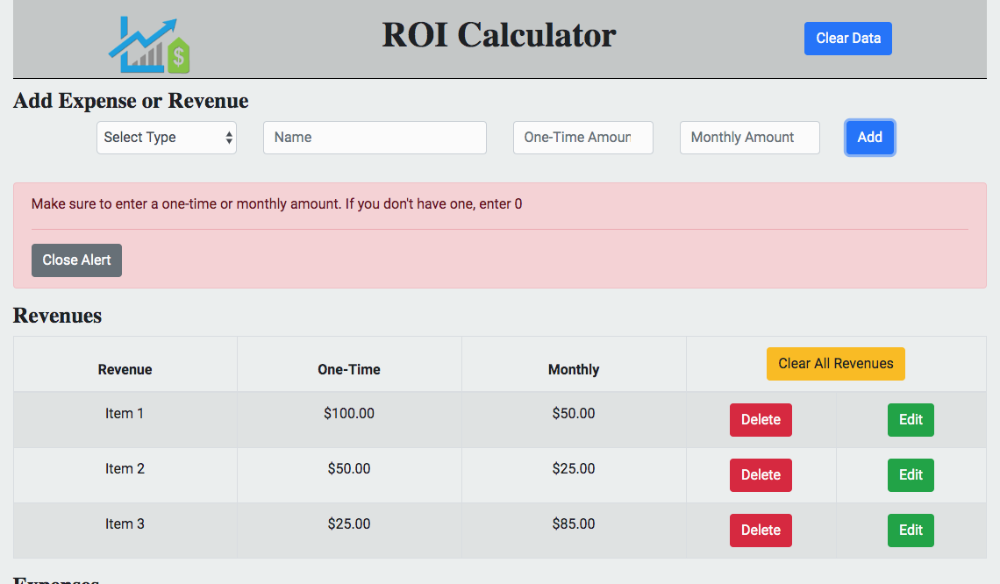
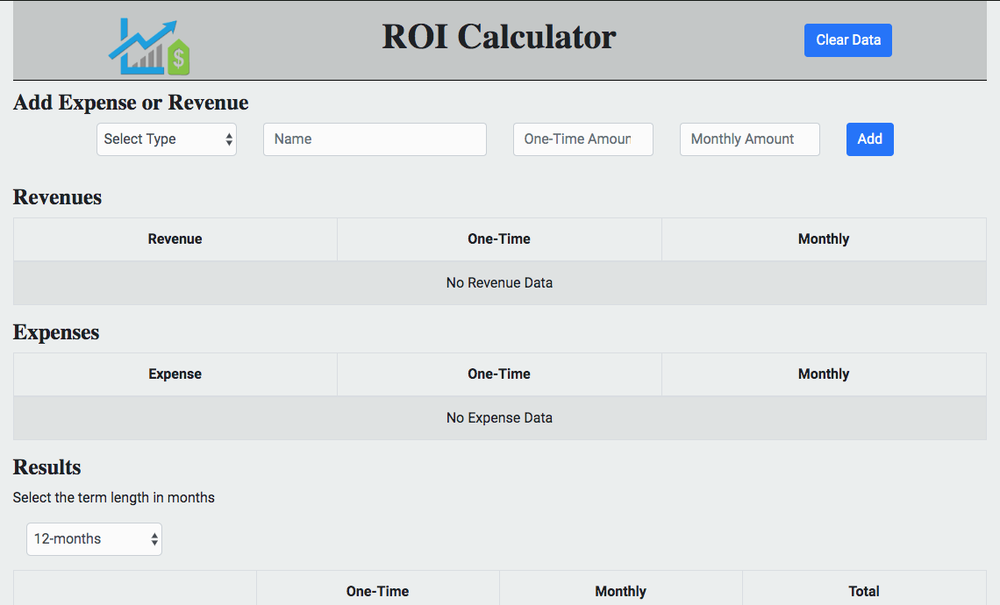
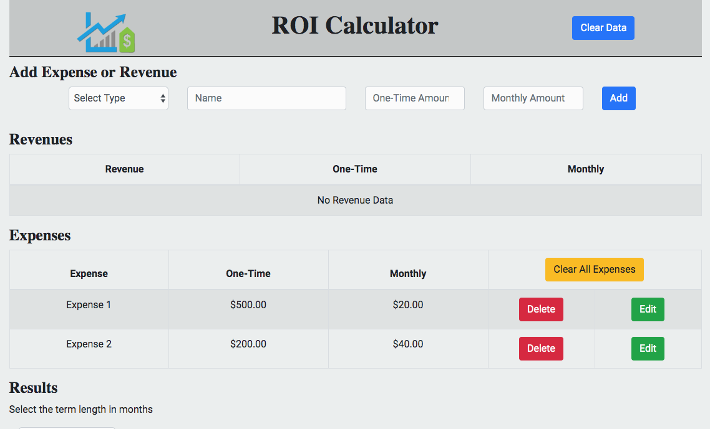
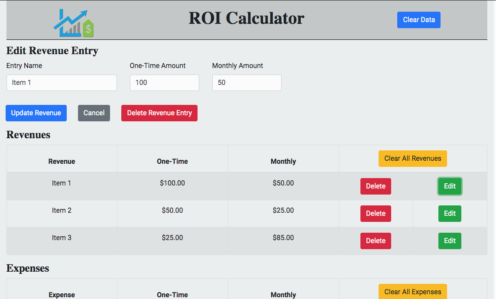
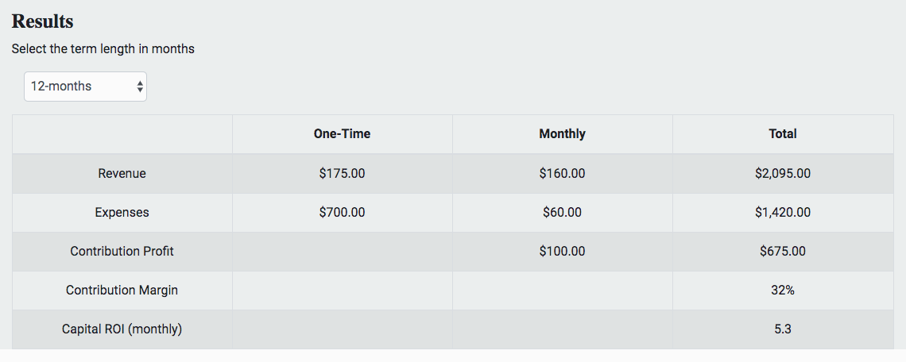

# ROI Calculator

## About the app

This app allows one to enter revenues and expenses to see an immediate calculation of a variety of ROI formulas.

View the deployed site at: http://zayo-roi.surge.sh/

## Home

The home page shows several revenue and expense entries on load. The initial entries are for demonstration purposes and to help users play around with the app easier. To clear the existing data, a user can click “Clear Data” in the header.

The top of the screen has a form which allows a user to enter a new revenue or expense item.

## Form Validation

When submitting a form, the app checks to make sure there is an appropriate entry type, name, one-time amount, and monthly-amount. Failing to enter the correct information prompts an error dialogue box that provides the user with information on what they need to fix

## Clear Data

If a user wants to start with a blank slate, he/she can simply click “Clear Data” in the header. This will remove all entries from the Revenue and Expense tables.

## Clear Revenue or Expense Table

If a user wants to clear either the Revenue or the Expense table, they simply click “Clear All Revenues” or “Clear All Expenses” to delete the appropriate entries. Once cleared, the button to clear the data disappears until new data has been entered for the empty table.

## Edit Entries

A user can edit an entry by clicking “Edit” in the table. This renders a form at the top with pre-filled information for that entry. A user can change any of that info and then click “Update Revenue” or “Update Expense” to update the entry. The user also has the option to delete the entry or to cancel editing.

Failing to provide the appropriate information prompts an error dialogue box info on what to change.

## Results

The bottom table in the app displays the ROI results. This information is updated automatically whenever expenses or revenues change. The entries for the ROI values change to red if the calculation results in a negative number.

The default term length for the ROI calculations is 12 months, but the user can select up to 60 months by choosing the value from the dropdown. This change also causes an automatic update to the ROI calculations.

